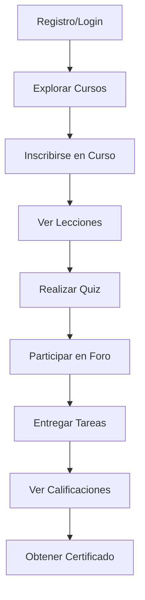
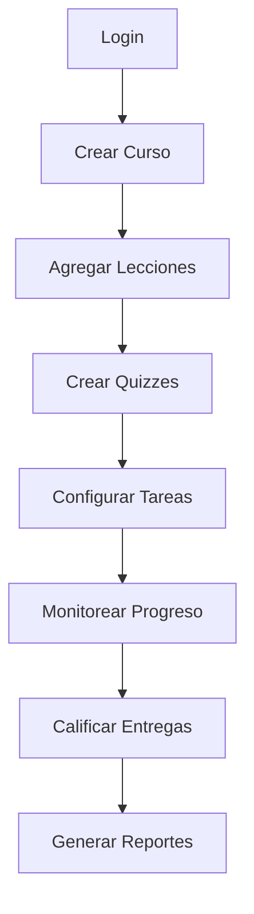
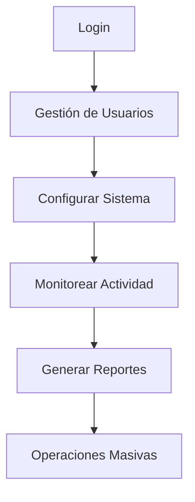

# Plan de Pruebas de Integración - Sistema IFAP

## 📋 Resumen Ejecutivo

Este documento presenta un plan completo de pruebas de integración para el Sistema Web del Instituto de Formación Archivística del Perú (IFAP). El plan cubre todos los aspectos solicitados: integración backend-frontend, módulos, flujos de usuario, funcionalidades específicas, rendimiento y seguridad.

## 🏗️ Análisis de Arquitectura del Sistema

### Backend (Django + Python)
- **Framework**: Django 5.2.6 con Django REST Framework
- **Base de datos**: SQLite (desarrollo) / PostgreSQL (producción)
- **Autenticación**: JWT (JSON Web Tokens)
- **WebSockets**: Django Channels con Redis
- **Cache**: Redis para sesiones y API
- **Módulos principales**:
  - `users`: Gestión de usuarios y autenticación
  - `courses`: Cursos y gestión académica
  - `lessons`: Lecciones y contenido
  - `quizzes`: Sistema de evaluaciones
  - `notifications`: Notificaciones en tiempo real
  - `forum`: Foro de discusión
  - `tasks`: Sistema de tareas y asignaciones
  - `library`: Biblioteca digital
  - `chat`: Chat en tiempo real

### Frontend (React + JavaScript)
- **Framework**: React 19.1.1 con Vite
- **UI**: Material-UI + Tailwind CSS
- **Rutas**: React Router DOM
- **HTTP Client**: Axios con interceptores
- **WebSockets**: WebSocket nativo
- **Estado**: Context API + Hooks personalizados
- **Autenticación**: JWT con refresh automático

### Servicios Externos
- **Redis**: Para WebSockets y cache
- **Jitsi**: Videoconferencias
- **Etherpad**: Colaboración en tiempo real

## 🧪 Plan de Pruebas de Integración

### 1. Configuración del Entorno de Pruebas

#### 1.1 Requisitos del Entorno
```bash
# Backend
Python 3.11+
Django 5.2.6
Redis Server
PostgreSQL (opcional)

# Frontend
Node.js 18+
npm/yarn
```

#### 1.2 Configuración de Servidores de Prueba
- **Backend**: `http://localhost:8000` (principal), `http://localhost:8001` (alternativo)
- **Frontend**: `http://localhost:5173` (desarrollo)
- **WebSocket**: `ws://localhost:8000/ws/`
- **Redis**: `redis://127.0.0.1:6379`

#### 1.3 Preparación de Datos de Prueba
- Crear usuarios de prueba (admin, instructor, estudiante)
- Generar cursos de prueba con lecciones y quizzes
- Configurar foros y chats de prueba
- Preparar archivos de biblioteca de prueba

### 2. Pruebas de Integración Backend-Frontend

#### 2.1 Comunicación API REST
**Objetivo**: Verificar que todas las APIs funcionan correctamente

**Endpoints a probar**:
- ✅ Health Check: `/api/health/`
- ✅ Autenticación: `/api/users/login/`, `/api/users/register/`
- ✅ Cursos: `/api/courses/`
- ✅ Lecciones: `/api/lessons/`
- ✅ Quizzes: `/api/quizzes/`
- ✅ Notificaciones: `/api/notifications/`
- ✅ Foro: `/api/forum/`
- ✅ Tareas: `/api/tasks/`
- ✅ Biblioteca: `/api/library/`
- ✅ Chat: `/api/chat/`

**Método de prueba**:
```javascript
// Ejemplo de prueba API
const testAPIConnection = async () => {
  try {
    const response = await api.get('/health/');
    console.log('✅ API Connection:', response.status);
    return response.status === 200;
  } catch (error) {
    console.error('❌ API Connection failed:', error);
    return false;
  }
};
```

#### 2.2 WebSockets en Tiempo Real
**Objetivo**: Verificar funcionalidad del chat en tiempo real

**Casos de prueba**:
- ✅ Conexión WebSocket
- ✅ Envío y recepción de mensajes
- ✅ Indicadores de escritura
- ✅ Estados de usuario (online/offline)
- ✅ Notificaciones push
- ✅ Reconexión automática

#### 2.3 Autenticación JWT
**Objetivo**: Verificar sistema de autenticación completo

**Casos de prueba**:
- ✅ Registro de usuario
- ✅ Login correcto/incorrecto
- ✅ Refresh automático de tokens
- ✅ Logout y limpieza de sesiones
- ✅ Protección de rutas
- ✅ Persistencia de sesión

#### 2.4 Manejo de Errores End-to-End
**Objetivo**: Verificar manejo de errores en toda la cadena

**Casos de prueba**:
- ✅ Errores de red (timeout, conexión)
- ✅ Errores de autenticación (401, 403)
- ✅ Errores de validación (400)
- ✅ Errores del servidor (500)
- ✅ Recuperación automática
- ✅ Logging de errores

### 3. Pruebas de Integración de Módulos

#### 3.1 Cursos con Lecciones y Quizzes
**Flujo de integración**:
```
Curso → Lecciones → Quiz → Resultados → Progreso
```

**Casos de prueba**:
- ✅ Crear curso con lecciones
- ✅ Agregar quiz a lección
- ✅ Realizar quiz completo
- ✅ Calcular calificación automática
- ✅ Actualizar progreso del estudiante
- ✅ Generar certificado

#### 3.2 Usuarios con Roles y Permisos
**Matriz de permisos**:
| Rol | Cursos | Quizzes | Foro | Tareas | Admin |
|-----|--------|---------|------|--------|-------|
| Admin | ✅✅✅ | ✅✅✅ | ✅✅✅ | ✅✅✅ | ✅✅✅ |
| Instructor | ✅✅ | ✅✅ | ✅✅ | ✅✅ | ❌ |
| Estudiante | ✅ | ✅ | ✅ | ✅ | ❌ |

#### 3.3 Chat con Notificaciones
**Flujo de integración**:
```
Mensaje → WebSocket → Notificación → Email/SMS
```

**Casos de prueba**:
- ✅ Enviar mensaje en chat
- ✅ Recibir notificación en tiempo real
- ✅ Marcar como leído
- ✅ Historial de mensajes
- ✅ Chat grupal por curso

#### 3.4 Foro con Comentarios
**Flujo de integración**:
```
Tema → Comentario → Respuesta → Moderación
```

**Casos de prueba**:
- ✅ Crear tema en foro
- ✅ Agregar comentarios
- ✅ Sistema de votos
- ✅ Moderación de contenido
- ✅ Notificaciones de respuestas

#### 3.5 Tareas con Asignaciones
**Flujo de integración**:
```
Tarea → Asignación → Entrega → Calificación
```

**Casos de prueba**:
- ✅ Crear tarea con archivos
- ✅ Asignar a estudiantes
- ✅ Recibir entregas
- ✅ Calificar y dar feedback
- ✅ Sistema de plazos

### 4. Pruebas de Flujos de Usuario Completos

#### 4.1 Flujo de Estudiante


#### 4.2 Flujo de Instructor


#### 4.3 Flujo de Administrador


### 5. Pruebas de Funcionalidades Específicas

#### 5.1 Funcionalidades Administrativas
- ✅ Gestión masiva de usuarios
- ✅ Configuración del sistema
- ✅ Reportes y estadísticas
- ✅ Operaciones bulk (activar/desactivar cursos)
- ✅ Auditoría de acciones

#### 5.2 Funcionalidades de Instructor
- ✅ Dashboard personalizado
- ✅ Creación y edición de cursos
- ✅ Gestión de estudiantes
- ✅ Calificación automática
- ✅ Análisis de rendimiento

#### 5.3 Funcionalidades de Estudiante
- ✅ Dashboard de progreso
- ✅ Inscripción en cursos
- ✅ Realización de actividades
- ✅ Consulta de calificaciones
- ✅ Descarga de certificados

### 6. Pruebas de Rendimiento End-to-End

#### 6.1 Tiempos de Respuesta
**Métricas objetivo**:
- ✅ API Health Check: < 100ms
- ✅ Autenticación: < 500ms
- ✅ Carga de cursos: < 1s
- ✅ WebSocket conexión: < 200ms
- ✅ Carga de página completa: < 2s

#### 6.2 Pruebas de Carga
- ✅ 50 usuarios concurrentes
- ✅ 1000 requests/minuto
- ✅ WebSocket 100 conexiones simultáneas
- ✅ Carga de archivos grandes

#### 6.3 Funcionalidad de Cache
- ✅ Cache de cursos populares
- ✅ Cache de sesiones de usuario
- ✅ Cache de respuestas API
- ✅ Invalidación automática

### 7. Pruebas de Seguridad

#### 7.1 Protección de Rutas
- ✅ Autenticación requerida
- ✅ Autorización por roles
- ✅ Protección CSRF
- ✅ Rate limiting

#### 7.2 Validación de Permisos
- ✅ Control de acceso granular
- ✅ Validación de ownership
- ✅ Permisos de archivos
- ✅ Logs de auditoría

#### 7.3 Manejo de Sesiones
- ✅ Expiración automática
- ✅ Invalidación manual
- ✅ Protección contra hijacking
- ✅ Secure cookies

#### 7.4 Protección contra Ataques Comunes
- ✅ SQL Injection prevention
- ✅ XSS protection
- ✅ CSRF tokens
- ✅ Rate limiting
- ✅ Input validation

## 🛠️ Herramientas y Metodologías

### Herramientas de Prueba
- **Backend**: Django Test Framework, pytest
- **Frontend**: Jest, React Testing Library
- **API**: Postman, Insomnia
- **Performance**: Apache JMeter, k6
- **WebSocket**: WebSocket King, Artillery
- **E2E**: Playwright, Cypress

### Metodología
1. **Pruebas Unitarias**: Funcionalidad individual
2. **Pruebas de Integración**: Módulos combinados
3. **Pruebas End-to-End**: Flujos completos
4. **Pruebas de Regresión**: Después de cambios
5. **Pruebas de Performance**: Bajo carga
6. **Pruebas de Seguridad**: Análisis de vulnerabilidades

## 📊 Métricas de Éxito

### Métricas Funcionales
- ✅ 100% endpoints API funcionales
- ✅ 100% WebSocket conexiones estables
- ✅ 100% flujos de usuario completados
- ✅ 0 errores críticos en producción

### Métricas de Performance
- ✅ Tiempo de respuesta promedio < 500ms
- ✅ Throughput > 1000 requests/minuto
- ✅ Uptime > 99.9%
- ✅ Error rate < 0.1%

### Métricas de Seguridad
- ✅ 0 vulnerabilidades críticas
- ✅ 100% endpoints protegidos
- ✅ Logs de auditoría completos
- ✅ Cumplimiento con estándares

## 📈 Plan de Ejecución

### Fase 1: Configuración (1-2 días)
- [ ] Configurar entornos de prueba
- [ ] Preparar datos de prueba
- [ ] Configurar herramientas

### Fase 2: Pruebas Básicas (2-3 días)
- [ ] Pruebas de API REST
- [ ] Pruebas de WebSocket
- [ ] Pruebas de autenticación

### Fase 3: Pruebas de Integración (3-4 días)
- [ ] Integración de módulos
- [ ] Flujos de usuario
- [ ] Funcionalidades específicas

### Fase 4: Pruebas Avanzadas (2-3 días)
- [ ] Performance testing
- [ ] Security testing
- [ ] Load testing

### Fase 5: Reporte y Optimización (1-2 días)
- [ ] Análisis de resultados
- [ ] Generar recomendaciones
- [ ] Documentar hallazgos

## 🎯 Recomendaciones Finales

### Prioridades Críticas
1. **Seguridad**: Implementar todas las medidas de protección
2. **Performance**: Optimizar consultas y cache
3. **Escalabilidad**: Preparar para crecimiento
4. **Monitorización**: Logs y alertas en tiempo real

### Mejores Prácticas
- Implementar CI/CD pipeline
- Monitoreo continuo de performance
- Revisiones de seguridad regulares
- Documentación actualizada
- Entrenamiento del equipo

### Próximos Pasos
1. Ejecutar plan de pruebas
2. Implementar mejoras identificadas
3. Establecer procesos de QA
4. Preparar para producción
5. Monitoreo continuo

---

**Documento creado por**: Arquitecto de Pruebas IFAP
**Fecha**: Septiembre 2025
**Versión**: 1.0